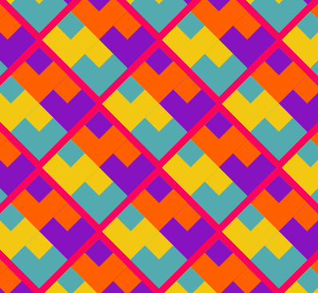

## You will make

قم بإنشاء قطعة فنية ملهمة يمكن تحجيمها باستخدام أنماط متكررة.

سيحتاج كتابك إلى تلبية **ملخص المشروع**.

ملخص المشروع يوضح ما يجب ان يفعله المشروع. إنه يشبه إلى حد ما إعطاء مهمة لإكمالها.

سوف تقوم بمايلي:
+ رسم ووضع أشكال هندسية لإنشاء نمط أساسي (أو "نموذج")
+ استخدم حلقات `for` التكرارية `لترجمة` النمط لملء الشاشة
+ استخدم `frame_rate` و `frame_count` لتحريك إنشاء النمط

الأنماط في كل مكان حولنا ، في المنسوجات والطبيعة والفن والتقاليد والتصميم. تسمى نقطة البداية للنمط a motif، وهو عنصر يمكن تكراره وترتيبه من أجل إنشاء العديد من الأنماط المختلفة.

--- no-print ---

### Play ▶️

--- task ---

  

Click the **Run** button below to see this example and think about the repeated motif. كيف تصف ما يحدث في الرسوم المتحركة؟
**Kek lapis Sarawak**:
<iframe src="https://editor.raspberrypi.org/en/embed/viewer/repeated-patterns-example" width="600" height="600" frameborder="0" marginwidth="0" marginheight="0" allowfullscreen>
</iframe>

You can find the Kek lapis Sarawak project [here](https://editor.raspberrypi.org/en/projects/repeated-patterns-example){:target="_blank"}
--- /task ---

### ملخص المشروع: أنشئ **نمطًا قويًا**

 

يجب أن يكون النمط القوي الخاص بك:
+ ارسم أشكالًا هندسية وموضعها لإنشاء نمط أساسي
+ استخدم الحلقات لتكرار النمط لملء الشاشة
+ تحريك الطريقة تم إنشاء النمط

يمكن لنمطك القوي:
+ استخدام ألوان جريئة أو مهمة
+ استلهم من ثقافتك أو ثقافتك الشعبية
+ احصل على مدخلات المستخدم لتغيير حجم النمط
+ أضف نصًا ورموز تعبيرية لطباعة التفاصيل حول فنك
+ ترجمة النمط لإنشاء اختلافات

### احصل على الإلهام

--- task ---

قم بتشغيل هذه المشاريع النموذجية للحصول على أفكار لنمطك.

كيف تم صنع الزخارف من الدوائر والأشكال البيضاوية والمربعات والمستطيلات والمثلثات ؟:

**اللوالب**: [انظر الى الداخل](https://trinket.io/python/d14eed3698){:target="_blank"}
<iframe src="https://editor.raspberrypi.org/en/embed/viewer/spirals-pattern-example" width="600" height="700" frameborder="0" marginwidth="0" marginheight="0" allowfullscreen>
</iframe> You can find the Spirals project [here](https://editor.raspberrypi.org/en/projects/spirals-pattern-example){:target="_blank"}

**وجوه عشوائية**: [انظر الى الداخل](https://trinket.io/python/9722201267){:target="_blank"}
<iframe src="https://editor.raspberrypi.org/en/embed/viewer/random-faces-example" width="600" height="700" frameborder="0" marginwidth="0" marginheight="0" allowfullscreen>
</iframe> You can find the Random faces project [here](https://editor.raspberrypi.org/en/projects/random-faces-example){:target="_blank"}

**خلفية آرت ديكو**: [انظر الى الداخل](https://trinket.io/python/6076e2ced4){:target="_blank"}
<iframe src="https://editor.raspberrypi.org/en/embed/viewer/art-deco-example" width="600" height="700" frameborder="0" marginwidth="0" marginheight="0" allowfullscreen>
</iframe> You can find the Art deco project [here](https://editor.raspberrypi.org/en/projects/art-deco-example){:target="_blank"}

**نسيج Yakan**: [انظر الى الداخل](https://trinket.io/python/940804eadc){:target="_blank"}
<iframe src="https://editor.raspberrypi.org/en/embed/viewer/yakan-weaving-example" width="600" height="700" frameborder="0" marginwidth="0" marginheight="0" allowfullscreen>
</iframe> You can find the Yakan weaving project [here](https://editor.raspberrypi.org/en/projects/yakan-weaving-example){:target="_blank"}

--- /task ---

--- /no-print ---

--- print-only ---

انظر إلى هذه الأمثلة وفكر في الفكرة المتكررة. كيف تم صنع الأنماط من الدوائر والأشكال البيضاوية والمربعات والمستطيلات والمثلثات؟

 يمكنك العثور على مشروع Kek lapis Sarawak هنا https://trinket.io/python/a831abfa03  يمكنك العثور على مشروع Spirals هنا https://trinket.io/python/d14eed3698  يمكنك العثور على الوجوه العشوائية المشروع هنا https://trinket.io/python/9722201267  يمكنك العثور على مشروع Art deco هنا https://trinket.io/python/6076e2ced4  يمكنك العثور على مشروع Yakan للنسيج هنا https://trinket.io/python/940804eadc

--- /print-only ---

