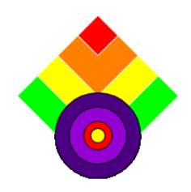

## بناء واختبار - الحافز

حان الوقت الآن لجعل العنصر الخاص بك ، العنصر الأول في نمطك.

{:width="300px"}

تعكس عملية صنع التصميم الخاص بك ما يفعله علماء الكمبيوتر غالبًا عند إنشاء برنامج أو حل لمشكلة ما. تسمى هذه العملية **التحلل** وسوف تستخدم التحلل لإنشاء الشكل الخاص بك.

**التفكيك** هو تقسيم المشروع إلى أجزاء أصغر وأسهل في الفهم. هذا يعني أنه يمكنك بناء مشروع. جزء واحد في كل مرة حتى تكمله.

انظر إلى النمط الذي تريد إعادة إنشائه. كيف يمكنك تقسيمه إلى عنصر واحد (العنصر) يتكرر؟

في هذا المثال ، تم تحلل نمط ورق الحائط من فن الآرت ديكو إلى المجموعة الأساسية من الأشكال (خمس دوائر متراكبة) التي تجعل الشكل:

**نصيحة:** تذكر أن تختبر مشروعك في كل مرة تضيف شيئًا. من الأسهل بكثير العثور على الأخطاء وإصلاحها قبل إجراء المزيد من التغييرات.

--- task ---

لقد اكتسبت بعض المهارات المفيدة حقًا. إليك تذكير لمساعدتك في صنع الشكل الخاص بك:

### الأشكال والصور

[[[processing-python-ellipse]]]

[[[processing-python-rect]]]

[[[processing-python-triangle]]]

[[[processing-add-image]]]

### الألوان والتأثيرات

[[[generic-theory-simple-colours]]]

[[[processing-opacity]]]

[[[processing-stroke]]]

[[[processing-tint]]]

### الموقع والتحويل

[[[processing-matrix]]]

[[[processing-translation]]]

[[[processing-rotation]]]

[[[python-operators]]]

[[[generic-python-for-loop-repeat]]]

--- /task ---

--- task ---

**اختبار:** اعرض مشروعك على شخص آخر واحصل على ملاحظاته. هل تريد إجراء أي تغييرات على الشكل الخاص بك؟

--- /task ---

--- task ---

**تصحيح:** قد تجد بعض الأخطاء في مشروعك والتي تحتاج إلى إصلاحها. فيما يلي بعض الأخطاء الشائعة.

--- collapse ---
---
title: لم تتم محاذاة الأشكال كما توقعت
---

إذا كنت تريد محاذاة الأشكال ، فقم بإلقاء نظرة فاحصة على نقاط الإحداثيات الخاصة بك. جرب الأرقام حتى تحصل على التصميم الذي تريده.

--- /collapse ---

--- collapse ---

---
title: لا أستطيع رؤية بعض الأشكال في تصميمي. 
---

الترتيب الذي ترسم به الأشياء مهم جدًا.

تتكون رسومات الكمبيوتر من طبقات. في التصميم الخاص بك ، كل شكل عبارة عن طبقة. تقع الكائنات الموجودة في الطبقات العليا أمام الكائنات الموجودة في الطبقات السفلية. تخيل قص كل الأشكال من الورق. اعتمادًا على كيفية ترتيب وتداخل تلك الورقة، قد تبدو النتيجة النهائية مختلفة تمامًا.

--- /collapse ---

--- collapse ---

---
title: دوائري / مربعاتي غير متساوية
---

العددان الثالث والرابع في `القطع الناقص` `والسحب` هما العرض والارتفاع. إذا قمت بعملهما نفس الشيء ، فستحصل على دائرة أو مربع.

--- /collapse ---

قد تجد خطأ غير مدرج هنا. هل يمكنك معرفة كيفية إصلاحه؟

نحن نحب أن نسمع عن أخطائك وكيفية إصلاحها. استخدم زر التعليقات في أسفل هذه الصفحة إذا وجدت خطأ مختلفًا في مشروعك.

--- /task ---

--- save ---
