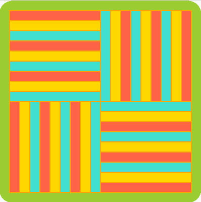
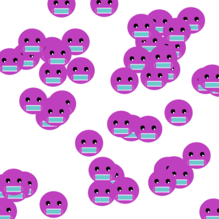

## Cyflwyniad

Byddwch chi'n creu celf ysbrydoledig mae modd ei chwyddo gan ddefnyddio patrymau wedi'u hailadrodd.

Bydd angen i'ch patrwm pwerus fodloni **briff y prosiect**.

Mae briff prosiect yn disgrifio'r hyn mae'n rhaid i brosiect ei wneud. Mae fel cael tasg arbennig i'w chwblhau.

Byddi di'n:
+ Llunio a lleoli siapiau geometrig i greu patrwm sylfaen (neu 'motiff')
+ Defnyddio dolenni `for` i drosi'r patrwm i lenwi'r sgrin
+ Defnyddio `frame_rate` a `frame_count` i animeiddio cread y patrwm

Mae patrymau ym mhob man - mewn tecstilau, byd natur, traddodiadau a dyluniadau. Motiff, sef elfen mae modd ei hailadrodd a'i threfnu i greu nifer o wahanol batrymau, yw enw man cychwyn patrwm.

--- no-print ---

--- task ---

Rhedwch yr enghraifft hon a meddwl am y motiff sy'n cael ei ailadrodd. Sut fyddech chi'n disgrifio'r hyn sy'n digwydd yn yr animeiddiad?

**Kek lapis Sarawak**: [Gweld tu mewn](https://trinket.io/python/81be7eb895){:target="_blank"}

  <iframe src="https://trinket.io/embed/python/81be7eb895?outputOnly=true&start=result" width="600" height="500" frameborder="0" marginwidth="0" marginheight="0" allowfullscreen>
  </iframe>

--- /task ---

### BRIFF Y PROSIECT: Creu **patrwm pwerus**

 

Fe ddylai eich patrwm pwerus wneud y canlynol:
+ Llunio a lleoli siapiau geometrig i greu patrwm sylfaen
+ Defnyddio dolenni i ailadrodd y patrwm i lenwi'r sgrin
+ Animeiddio sut mae'r patrwm yn cael ei greu

Fe allai eich patrwm pwerus wneud y canlynol:
+ Defnyddio lliwiau trawiadol neu arwyddocaol
+ Cael ei ysbrydoli gan eich diwylliant neu ddiwylliant poblogaidd
+ Gofyn am fewnbwn defnyddiwr i newid maint y patrwm
+ Ychwanegu testun ac emoji i brintio manylion am eich celfwaith
+ Trosi'r patrwm i greu amrywiadau

### Cael ysbrydoliaeth

--- task ---

Rhedwch y prosiectau enghreifftiol hyn i gael syniadau ar gyfer eich patrwm.

Sut mae'r motiffau wedi cael eu gwneud o gylchoedd, elipsau, sgwariau, petryalau a thrionglau?

**Spirals**: [See inside](https://trinket.io/python/a682f7a884){:target="_blank"}

  <iframe src="https://trinket.io/embed/python/a682f7a884?outputOnly=true&start=result" width="600" height="500" frameborder="0" marginwidth="0" marginheight="0" allowfullscreen>
  </iframe>

**Wynebau ar hap**: [Gweld tu mewn](https://trinket.io/python/c45185fd44){:target="_blank"}

  <iframe src="https://trinket.io/embed/python/c45185fd44?outputOnly=true&start=result" width="600" height="500" frameborder="0" marginwidth="0" marginheight="0" allowfullscreen>
  </iframe>

**Papur wal Art Deco**: [Gweld tu mewn](https://trinket.io/python/300e1cd325){:target="_blank"}

  <iframe src="https://trinket.io/embed/python/300e1cd325?outputOnly=true&start=result" width="600" height="500" frameborder="0" marginwidth="0" marginheight="0" allowfullscreen>
  </iframe>

**Gwehyddu Yakan**: [Gweld tu mewn](https://trinket.io/python/20646dd7f4){:target="_blank"}

  <iframe src="https://trinket.io/embed/python/20646dd7f4?outputOnly=true&start=result" width="600" height="500" frameborder="0" marginwidth="0" marginheight="0" allowfullscreen>
  </iframe>

--- /task ---

--- /no-print ---

--- print-only ---

'Drychwch ar yr enghreifftiau hyn a meddwl am y motiff sy'n cael ei ailadrodd. Sut mae'r patrymau wedi cael eu gwneud o gylchoedd, elipsau, sgwariau, petryalau a thrionglau?

 Mae'r prosiect Kek lapis Sarawak ymae https://trinket.io/python/81be7eb895  Mae'r prosiect Troellau yma https://trinket.io/python/a682f7a884  Mae'r prosiect Wynebau ar hap yma https://trinket.io/python/c45185fd44  Mae'r prosiect Art Deco yma https://trinket.io/python/300e1cd325  Mae'r prosiect Gwehyddu Yakan yma https://trinket.io/python/20646dd7f4

--- /print-only ---

