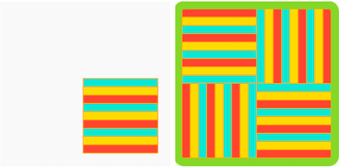

## Ehangu a phrofi: Patrwm

Amser creu eich patrwm llawn!

Ystyr echdynnu yw datrys problemau drwy leihau'r manylion diangen. 

--- task ---

'Drychwch ar y gacen haenog hon o Faleisia (kek lapis Sarawak). Sut mae'r motiff yn newid i greu'r patrwm cyflawn?

'Drychwch ar y papur wal Art Deco hwn. Sut mae'r motiff yn newid i wneud y patrwm cyflawn?

Meddyliwch am y patrwm rydych chi'n ei wneud. Sut mae eich motiff yn newid i wneud y patrwm cyflawn. Defnyddiwch y cwestiynau hyn i'ch helpu chi i echdynnu:
- A yw'r motiff cyfan yn cylchdroi, neu ddim ond rhan ohono?
- I ba gyfeiriad mae'n cylchdroi? Ac o faint?
- Oes haenau'n gorgyffwrdd yn y patrwm?
- Sawl gwaith mae'r motiff yn ailadrodd ei hun?
- Sut mae'r ailadrodd wedi'i drefnu (h.y. sawl rhes/colofn)?
- A yw'r lliwiau'n newid?
- Oes manylion heb eu cynnwys yn y motiff (h.y. yr eisin yn y gacen haenog o Faleisia)?

--- /task ---

--- task ---

Nawr eich bod yn gwybod mwy am sut mae'r motiff yn troi'n batrwm cyflawn, fe allwch ei raglennu gan ddefnyddio eich atebion i'r cwestiynau uchod.

**Tip:** Don't forget you can 'See Inside' any of the examples in the introduction and 'copy' and 'paste' code into your project. Mae datblygwyr proffesiynol yn gwneud hyn drwy'r amser!

Rydych chi wedi meithrin sgiliau defnyddiol iawn. Dyma eich atgoffa i'ch helpu chi i greu eich patrwm sy'n ailadrodd:

[[[processing-matrix]]]

[[[processing-translation]]]

[[[processing-rotation]]]

[[[python-operators]]]

[[[generic-python-for-loop-repeat]]]

--- collapse ---

---
title: Safleoedd ar hap
---

Fe allwch chi ychwanegu `from random import randint` ar frig **main.py**, mae hyn yn gadael i chi ddefnyddio'r swyddogaeth `randint` i gynhyrchu rhifau ar hap.

I ddefnyddio'r swyddogaeth `randint`, mae angen i chi ei galw yn eich cod.

Un ffordd o ddefnyddio nodwedd ar hap yw symud eich motiff i safle ar hap bob tro mae'n cael ei lunio:

--- code ---
---
language: python
filename: main.py - draw()

---

push_matrix() #Dechrau trawsnewid
translate(randint(0, 400), randint(0, 400))
llunio_motiff()
pop_matrix() #Ailosod y trawsnewid

--- /code ---

Fe allech chi hefyd ddefnyddio nodwedd ar hap i newid lliwiau eich motiff wrth iddo gael ei ail-lunio.

--- code ---
---
language: python
filename: main.py - draw()

---

GLAS = color(randint(0, 50), randint(0, 100), randint(150, 255))

--- /code ---

--- /collapse ---

--- collapse ---

---
title: Newid maint eich motiff
---

Os byddwch chi'n defnyddio motiff rydych chi wedi'i lunio'n barod, efallai na fydd y maint cywir.

Fe allwch chi ddefnyddio `scale()` cyn galw'r swyddogaeth sy'n llunio eich motiff i newid ei faint. Bydd defnyddio mewnbwn sy'n fwy nag '1' yn gwneud y motiff yn fwy, a bydd defnyddio mewnbwn sy'n llai nag '1' yn ei wneud yn llai.

--- code ---
---
language: python
filename: main.py - draw()

---

scale(0.5) #Hanner maint

--- /code ---

--- /collapse ---

--- /task ---

Nawr fe allwch chi animeiddio eich patrwm i ddangos sut rydych chi wedi'i wneud. Yn aml, mae gan batrymau arwyddocâd diwylliannol pwerus o ran y ffordd maen nhw'n cael eu gwneud, neu'r broses.

--- task ---

[[[processing-matrix]]]

[[[processing-translation]]]

[[[processing-rotation]]]

[[[generic-python-for-loop-repeat]]]

--- /task ---

--- task ---

**Profi:** Dangoswch eich prosiect i rywun arall a gofyn am eu hadborth. Ydych chi am wneud unrhyw newidiadau i'ch patrwm?

--- /task ---

--- task ---

**Difa chwilod:** Efallai bydd angen i chi drwsio chwilod yn eich prosiect. Dyma rai chwilod cyffredin.

--- collapse ---

---
title: Dydy fy motiff ddim i weld yn cylchdroi
---

Gwnewch yn siŵr eich bod yn defnyddio'r swyddogaeth `radian()` i drosi graddau'n radianau.

--- /collapse ---

--- collapse ---
---
title: Mae'r cylchdro'n edrych yn rhyfedd
---

Ydych chi wedi gwneud yn siŵr eich bod yn defnyddio `translate()` o ac i'r cyfesurynnau cywir?

Oes mwy nag un peth yn cylchdroi? Efallai bydd angen i chi ddefnyddio `push_matrix()` a `pop_matrix()` fel bod y sgrin yn cylchdroi ar wahanol bwyntiau ar unwaith.

--- /collapse ---

--- collapse ---
---
title: Dydy fy mhatrwm ddim yn animeiddio
---

Gwnewch yn siŵr eich bod wedi defnyddio `frame_count()` yn gywir mewn dolen.

--- /collapse ---

--- collapse ---
---
title: Dydy fy mhatrwm ddim yn edrych fel yr ydw i eisiau iddo edrych
---

Tarwch olwg arall ar yr adrannau uchod ynghylch `rotate()` a `translate()`. Arbrofwch nes ei fod yn edrych fel rydych chi eisiau iddo edrych a chofiwch, mae camgymeriadau'n bwerus!

--- /collapse ---

--- collapse ---
---
title: Dwi'n cael gwall
---

Gwiriwch gystrawen eich cod. Oes unrhyw gromfachau `(` neu `)` ar goll, neu efallai colon `:` ar ôl diffinio swyddogaeth? Oes rhywbeth wedi'i sillafu'n anghywir? A yw eich cod wedi'i fewnoli'n gywir?

--- /collapse ---

--- collapse ---
---
title: Mae'r animeiddiad yn rhy gyflym/rhy araf
---

Newidiwch y `frame_rate()` ar ddechrau eich rhaglen i gael y cyflymder rydych chi ei eisiau.

--- /collapse ---

Efallai byddwch chi'n dod o hyd i chwilen sydd ddim wedi'i rhestru yma. Allwch chi weithio allan sut i'w thrwsio?

Rydyn ni wrth ein bodd yn clywed am eich chwilod chi a sut gwnaethoch chi eu trwsio. Defnyddiwch y botwm Adborth ar waelod y dudalen hon os gwnaethoch chi ddod ar draws chwilen wahanol yn eich prosiect.

--- /task ---

--- save ---
