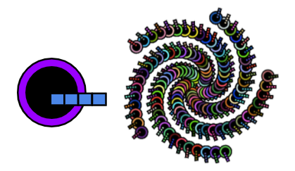

## Ανάπτυξη και δοκιμή: Μοτίβο

Τώρα ήρθε η ώρα να φτιάξεις το πλήρες μοτίβο σου!

Η αφαίρεση είναι η επίλυση προβλημάτων μειώνοντας τις περιττές λεπτομέρειες. 

--- task ---

Κοίταξε αυτό το μαλαισιανό κέικ με στρώσεις (kek lapis Sarawak). Πώς αλλάζει το κεντρικό σχέδιο για να δημιουργήσει το συνολικό μοτίβο;

Κοίταξε αυτήν την ταπετσαρία αρ ντεκό. Πώς αλλάζει το κεντρικό σχέδιο για να δημιουργήσει το συνολικό μοτίβο;

Σκέψου το μοτίβο που φτιάχνεις. Πώς αλλάζει το κεντρικό σχέδιο για να δημιουργήσει το συνολικό μοτίβο. Χρησιμοποίησε αυτές τις ερωτήσεις για να σε βοηθήσουν να αφαιρέσεις τις περιττές λεπτομέρειες:
- Περιστρέφεται ολόκληρο ή μέρος του κεντρικού σχεδίου;
- Προς ποια κατεύθυνση περιστρέφεται; Και κατά πόσο;
- Υπάρχουν στρώσεις στο μοτίβο που επικαλύπτονται;
- Πόσες φορές επαναλαμβάνεται το κεντρικό σχέδιο;
- Πώς οργανώνεται η επανάληψη (δηλαδή σε πόσες σειρές/στήλες);
- Αλλάζουν τα χρώματα;
- Υπάρχουν λεπτομέρειες που δεν περιλαμβάνονται στο κεντρικό σχέδιο (για παράδειγμα το γλάσο στο κέικ Μαλαισίας με στρώσεις);

--- /task ---

--- task ---

Τώρα που ξέρεις περισσότερα για το πώς το κεντρικό σχέδιο μετατρέπεται σε ολόκληρο το μοτίβο, μπορείς να το προγραμματίσεις χρησιμοποιώντας τις απαντήσεις σου στις παραπάνω ερωτήσεις.

**Tip:** Don't forget you can 'See Inside' any of the examples in the introduction and 'copy' and 'paste' code into your project. Οι επαγγελματίες προγραμματιστές/ριες το κάνουν αυτό συνεχώς!

Έχεις αναπτύξει μερικές πραγματικά χρήσιμες δεξιότητες. Ακολουθεί μια υπενθύμιση που θα σε βοηθήσει να φτιάξεις το δικό σου επαναλαμβανόμενο μοτίβο:

[[[processing-matrix]]]

[[[processing-translation]]]

[[[processing-rotation]]]

[[[python-operators]]]

[[[generic-python-for-loop-repeat]]]

--- collapse ---

---
title: Τυχαίες θέσεις
---

Μπορείς να προσθέσεις το `from random import randint` στο επάνω μέρος του **main.py**, αυτό σου επιτρέπει να χρησιμοποιήσεις τη συνάρτηση `randint` για να δημιουργήσεις τυχαίους αριθμούς.

Για να χρησιμοποιήσεις τη συνάρτηση `randint`, πρέπει να την καλέσεις στον κώδικά σου.

Ένας τρόπος για να χρησιμοποιήσεις το τυχαίο είναι να μετακινείς το κετρικό σου σχέδιο σε μια τυχαία θέση κάθε φορά που σχεδιάζεται:

--- code ---
---
language: python filename: main.py - draw()

---

push_matrix() #Start transformation translate(randint(0, 400), randint(0, 400)) draw_motif() pop_matrix() #Reset transformation

--- /code ---

Θα μπορούσες επίσης να χρησιμοποιήσεις το random για να αλλάξεις τα χρώματα στο κεντρικό σου σχέδιο καθώς επανασχεδιάζεται.

--- code ---
---
language: python filename: main.py - draw()

---

BLUE = color(randint(0, 50), randint(0, 100), randint(150, 255))

--- /code ---

--- /collapse ---

--- collapse ---

---
title: Αλλαγή του μεγέθους του κεντρικού σου σχεδίου
---

Εάν χρησιμοποιείς ένα κεντρικό σχέδιο που έχεις ήδη σχεδιάσει, μπορεί να μην είναι στο σωστό μέγεθος.

Μπορείς να χρησιμοποιήσεις το `scale()` πριν καλέσεις τη συνάρτηση που σχεδιάζει το κεντρικό σου σχέδιο για να αλλάξεις το μέγεθός του. Χρησιμοποιώντας είσοδο μεγαλύτερη από «1» θα κάνει το κεντρικό σχέδιο μεγαλύτερο, ενώ μια τιμή εισόδου μικρότερη από «1» θα το κάνει μικρότερο.

--- code ---
---
language: python filename: main.py - draw()

---

scale(0.5) #Half size

--- /code ---

--- /collapse ---

--- /task ---

Τώρα μπορείς να κινήσεις το μοτίβο σου για να δείξεις πώς το έφτιαξες. Συχνά, τα μοτίβα έχουν ισχυρή πολιτιστική σημασία στον τρόπο ή στη διαδικασία με την οποία κατασκευάζονται.

--- task ---

[[[processing-matrix]]]

[[[processing-translation]]]

[[[processing-rotation]]]

[[[generic-python-for-loop-repeat]]]

--- /task ---

--- task ---

**Δοκιμή:** Δείξε σε κάποιον άλλο το έργο σου και ζήτησε τα σχόλιά του. Θέλεις να κάνεις αλλαγές στο μοτίβο σου;

--- /task ---

--- task ---

**Εντοπισμός σφαλμάτων:** Ενδέχεται να βρεις κάποια σφάλματα στο έργο σου που πρέπει να διορθώσεις. Εδώ είναι μερικά κοινά σφάλματα.

--- collapse ---

---
title: Το κεντρικό μου σχέδιο δεν φαίνεται να περιστρέφεται
---

Βεβαιώσου ότι χρησιμοποιείς τη συνάρτηση `radian()` για να μετατρέψεις τις μοίρες σε ακτίνια.

--- /collapse ---

--- collapse ---
---
title: Η περιστροφή φαίνεται περίεργη
---

Έχεις ελέγξει ότι χρησιμοποιείς `translate()` από και προς τις σωστές συντεταγμένες;

Έχεις περισσότερα από ένα πράγματα που περιστρέφονται; Ίσως χρειαστεί να χρησιμοποιήσεις `push_matrix()` και `pop_matrix()` ώστε η οθόνη να περιστρέφεται σε διαφορετικά σημεία ταυτόχρονα.

--- /collapse ---

--- collapse ---
---
title: Το μοτίβο μου δεν κινείται
---

Έλεγξε ότι έχεις χρησιμοποιήσει σωστά το `frame_count()` σε έναν βρόχο.

--- /collapse ---

--- collapse ---
---
title: Το μοτίβο μου δεν φαίνεται όπως το θέλω
---

Έλεγξε τις παραπάνω ενότητες στο `rotate()` και `translate()`. Πειραματίσου μέχρι να φανεί όπως το θέλεις και να θυμάσαι ότι τα λάθη σου δίνουν δύναμη!

--- /collapse ---

--- collapse ---
---
title: Λαμβάνω ένα σφάλμα
---

Έλεγξε τη σύνταξη του κώδικά σου. Σου λείπουν αγκύλες `(` ή `)` άνω και κάτω τελεία `:` μετά τον ορισμό μιας συνάρτησης; Έχει γραφτεί κάτι λάθος; Ο κώδικάς σου έχει σωστές εσοχές;

--- /collapse ---

--- collapse ---
---
title: Το κινούμενο σχέδιο είναι πολύ γρήγορο/πολύ αργό
---

Άλλαξε το `frame_rate()` στην αρχή του προγράμματός σου για να το φτάσεις στην ταχύτητα που θέλεις.

--- /collapse ---

Πιθανόν να βρεις ένα σφάλμα που δεν αναφέρεται εδώ. Μπορείς να σκεφτείς πώς θα το λύσεις;

Μας αρέσει να μαθαίνουμε για τα σφάλματα που εντοπίζεις και πώς τα διορθώνεις. Χρησιμοποίησε την Αποστολή σχολίων στο κάτω μέρος αυτής της σελίδας και πες μας αν εντόπισες κάποιο διαφορετικό σφάλμα στο έργο σου.

--- /task ---

--- save ---
