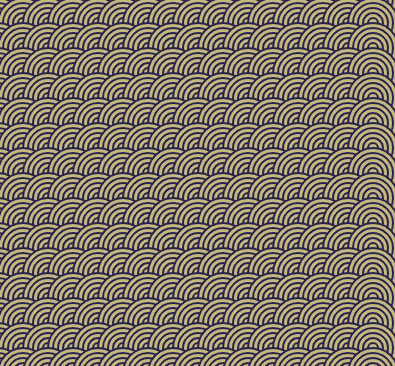

## Introduction

Create a piece of inspirational art that can be scaled using repeated patterns. 

Your powerful pattern will need to meet the **project brief**.

A project brief describes what a project must do. It's a bit like being given a mission to complete.

You will:
+ Draw and position geometric shapes to create a base pattern (or 'motif')
+ Use `for` loops to `translate` the pattern to fill the screen
+ Use the `frame_rate` and `frame_count` to animate the creation of the pattern

Patterns are all around us, in textiles, nature, art, traditions, and design. The starting point of a pattern is called a motif, which is an element that can be repeated and arranged in order to create many different patterns.

--- no-print ---

--- task ---

  

Run this example and think about the repeated motif. How would you describe what is happening in the animation? 

**Kek lapis Sarawak**: [See inside](https://trinket.io/python/81be7eb895){:target="_blank"}

  <iframe src="https://trinket.io/embed/python/81be7eb895?outputOnly=true&start=result" width="600" height="500" frameborder="0" marginwidth="0" marginheight="0" allowfullscreen>
  </iframe>

--- /task ---

### PROJECT BRIEF: Create a **powerful pattern**

 

Your powerful pattern should:
+ Draw and position geometric shapes to create a base pattern
+ Use loops to repeat the pattern to fill the screen
+ Animate how the pattern is created

Your powerful pattern could:
+ Use bold or significant colours
+ Draw inspiration from your culture or popular culture
+ Get user input to resize the pattern
+ Add text and emoji to print details about your art
+ Translate the pattern to create variations

### Get inspiration

--- task ---

Run these example projects to get ideas for your pattern. 

How have the motifs been made from circles, ellipses, squares, rectangles, and triangles?:

**Spirals**: [See inside](https://trinket.io/python/a682f7a884){:target="_blank"}

  <iframe src="https://trinket.io/embed/python/a682f7a884?outputOnly=true&start=result" width="600" height="500" frameborder="0" marginwidth="0" marginheight="0" allowfullscreen>
  </iframe>

**Random faces**: [See inside](https://trinket.io/python/c45185fd44){:target="_blank"}

  <iframe src="https://trinket.io/embed/python/c45185fd44?outputOnly=true&start=result" width="600" height="500" frameborder="0" marginwidth="0" marginheight="0" allowfullscreen>
  </iframe>

**Art deco wallpaper**: [See inside](https://trinket.io/python/300e1cd325){:target="_blank"}

  <iframe src="https://trinket.io/embed/python/300e1cd325?outputOnly=true&start=result" width="600" height="500" frameborder="0" marginwidth="0" marginheight="0" allowfullscreen>
  </iframe>

**Yakan weaving**: [See inside](https://trinket.io/python/20646dd7f4){:target="_blank"}

  <iframe src="https://trinket.io/embed/python/20646dd7f4?outputOnly=true&start=result" width="600" height="500" frameborder="0" marginwidth="0" marginheight="0" allowfullscreen>
  </iframe>

--- /task ---

--- /no-print ---

--- print-only ---

Look at these examples and think about the repeated motif. How have the patterns been made from circles, ellipses, squares, rectangles, and triangles?

You can find the Kek lapis Sarawak project here https://trinket.io/python/81be7eb895

You can find the Spirals project here https://trinket.io/python/a682f7a884

You can find the Random faces project here https://trinket.io/python/c45185fd44

You can find the Art deco project here https://trinket.io/python/300e1cd325

You can find the Yakan weaving project here https://trinket.io/python/20646dd7f4

--- /print-only ---

