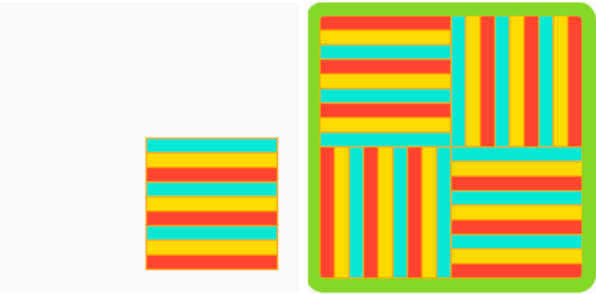

## Expand and test: Pattern

Now it's time to make your full pattern!

Abstraction is problem solving by reducing unnecessary detail. 

--- task ---

Look at this Malaysian layer cake (kek lapis Sarawak). How does the motif change to make the overall pattern?

Look at this art deco wallpaper. How does the motif change to make the overall pattern?

Think about the pattern you are making. How does your motif change to make the overall pattern? Use these questions to help you abstract:
- Does the whole, or part, of the motif rotate?
- What direction does it rotate? And by how much?
- Are there layers to the pattern that overlap?
- How many times does the motif repeat itself?
- How is the repetition organised (i.e. how many rows/columns)?
- Do the colours change?
- Are there details that are not included in the motif (i.e. the icing in the Malaysian layer cake)?

--- /task ---

--- task ---

Now that you know more about how the motif turns into the whole pattern, you can program it using your answers to the questions above.

**Tip:** You can 'copy' and 'paste' code from any of the examples in the introduction into your project. Professional developers do this all the time! 

You have built up some really useful skills. Here is a reminder to help you make your repeated pattern: 

[[[processing-matrix]]]

[[[processing-translation]]]

[[[processing-rotation]]]

[[[python-operators]]]

[[[generic-python-for-loop-repeat]]]

--- collapse ---

---
title: Random positions
---

You can add `from random import randint` at the top of **main.py**, this allows you to use the `randint` function to generate random numbers.

To use the `randint` function, you need to call it in your the code. 

One way to use random is to move your motif to a random position each time it is drawn:

--- code ---
---
language: python
filename: main.py - draw()

---

    push_matrix()  # Start transformation
    translate(randint(0, 400), randint(0, 400))
    draw_motif()
    pop_matrix()  # Reset transformation

--- /code ---

You could also use random to change the colours in your motif as it is redrawn. 

--- code ---
---
language: python
filename: main.py - draw()

---

    BLUE = color(randint(0, 50), randint(0, 100), randint(150, 255))

--- /code ---

--- /collapse ---

--- collapse ---

---
title: Changing the size of your motif
---

If you use a motif you have already drawn, it might not be the right size. 

You can use `scale()` before calling the function that draws your motif to change its size. Using an input bigger than '1' will make the motif bigger, using an input smaller than '1' will make it smaller. 

--- code ---
---
language: python
filename: main.py - draw()

---

    scale(0.5)  # Half size

--- /code ---

--- /collapse ---

--- /task ---

Now you can animate your pattern to show how you made it. Often, patterns have powerful cultural significance in the way that they are made, or the process.

--- task ---

[[[processing-matrix]]]

[[[processing-translation]]]

[[[processing-rotation]]]

[[[generic-python-for-loop-repeat]]]

--- /task ---

--- task ---

**Test:** Show someone else your project and get their feedback. Do you want make any changes to your pattern? 

--- /task ---

--- task ---

**Debug:** You might find some bugs in your project that you need to fix. Here are some common bugs.

--- collapse ---

---
title: My motif does not appear to rotate
---

Make sure you are using the `radian()` function to convert degrees to radians.

--- /collapse ---

--- collapse ---
---
title: The rotation looks strange
---

Have you checked that you are using `translate()` from and to the right coordinates? 

Do you have more than one thing rotating? You may need to use `push_matrix()` and `pop_matrix()` so the screen rotates at different points at once.

--- /collapse ---

--- collapse ---
---
title: My pattern does not animate
---

Check you have used `frame_count()` properly in a loop.

--- /collapse ---

--- collapse ---
---
title: My pattern does not look the way I want it to
---

Review the sections above on `rotate()` and `translate()`. Experiment until it looks like you want it to, and remember, mistakes are powerful!

--- /collapse ---

--- collapse ---
---
title: I get an error
---

Check the syntax of your code. Are you missing any brackets `(` or `)` or a colon `:` after defining a function? Is something spelled incorrectly? Is your code indented correctly?

--- /collapse ---

--- collapse ---
---
title: The animation is too fast/too slow
---

Change the number after `frame_rate = ` in the call to the `run()` function at the end of your program to get it to the speed you like.

--- /collapse ---

You might find a bug not listed here. Can you figure out how to fix it?

We love hearing about your bugs and how you fixed them. Use the feedback button at the bottom of this page if you found a different bug in your project.

--- /task ---

--- save ---
