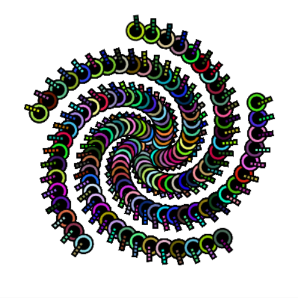
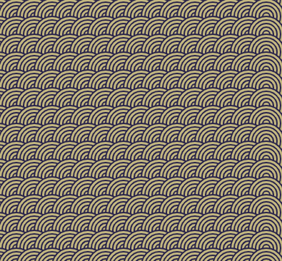

Créer une œuvre d'art inspirante qui peut être mise à l'échelle en utilisant des motifs répétés.

--- no-print ---

<iframe src="https://editor.raspberrypi.org/en/embed/viewer/repeated-patterns-example" width="600" height="600" frameborder="0" marginwidth="0" marginheight="0" allowfullscreen>
</iframe>

--- /no-print ---

--- print-only ---

Tu peux trouver le projet Spirales [ici](https://editor.raspberrypi.org/fr-FR/projects/spirals-pattern-example){:target="_blank"}

Tu peux trouver le projet Visages aléatoires [ici](https://editor.raspberrypi.org/fr-FR/projects/random-faces-example){:target="_blank"}

Tu peux trouver le projet Art déco [ici](https://editor.raspberrypi.org/fr-FR/projects/art-deco-example){:target="_blank"}

https://editor.raspberrypi.org/fr-FR/embed/viewer/yakan-weaving-example 

--- /print-only ---

