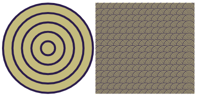

## Construire et tester : Motif

Il est maintenant temps de réaliser ton motif, le premier élément de ton modèle.

{:width="300px"}

Le processus de création de ton motif reflète ce que font souvent les informaticiens lorsqu'ils créent un programme ou une solution à un problème. Ce processus s'appelle **décomposition** et tu utiliseras la décomposition pour créer ton motif.

La décomposition consiste à décomposer quelque chose en parties plus petites et plus faciles à comprendre. Cela signifie que tu peux créer un motif une partie à la fois jusqu'à ce qu'il soit terminé.

Regarde le motif que tu souhaite recréer. Comment le décomposer en un seul élément (le motif) qui se répète ?

Dans cet exemple, un motif de papier peint art déco a été décomposé en une collection de formes de base (cinq cercles superposés) qui constitue le motif :

**Astuce :** N'oublie pas de tester ton projet à chaque fois que tu ajoutes quelque chose. Il est beaucoup plus facile de trouver et de corriger les bogues avant d'apporter d'autres modifications.

--- task ---

Tu as acquis des compétences vraiment utiles. Voici un rappel pour t'aider à réaliser ton motif :

### Formes et images

[[[processing-python-ellipse]]]

[[[processing-python-rect]]]

[[[processing-python-triangle]]]

[[[processing-add-image]]]

### Couleurs et effets

[[[generic-theory-simple-colours]]]

[[[processing-opacity]]]

[[[processing-stroke]]]

[[[processing-tint]]]

### Position et transformation

[[[processing-matrix]]]

[[[processing-translation]]]

[[[processing-rotation]]]

[[[python-operators]]]

[[[generic-python-for-loop-repeat]]]

--- /task ---

--- task ---

**Test :** Montre ton projet à quelqu'un d'autre pour avoir son avis. Tu souhaites apporter des modifications à ton motif ?

--- /task ---

--- task ---

**Débogage :** Il est possible que tu trouves des bogues dans ton projet que tu dois corriger. Voici quelques bogues assez courants.

--- collapse ---
---
title: Les formes ne sont pas alignées comme prévu
---

Si tu souhaites que les formes soient alignées, examine de plus près tes points de coordonnées. Expérimente avec les nombres jusqu'à ce que tu aies la disposition souhaitée.

--- /collapse ---

--- collapse ---

---
title: Je ne vois pas certaines des formes de mon motif
---

L'ordre dans lequel tu dessines les choses est très important.

L'infographie est composée de calques. Dans ton motif, chaque forme est une couche. Les objets des calques supérieurs se placent devant les objets des calques inférieurs. Imagine découper toutes les formes dans du papier. Selon la façon dont tu organises et superposes ce papier, le résultat final peut être très différent.

--- /collapse ---

--- collapse ---

---
title: Mes cercles/carrés ne sont pas égaux
---

Les troisième et quatrième nombres dans `ellipse` et `rect` sont la largeur et la hauteur. Si tu les fais identiques, tu obtiendras un cercle ou un carré.

--- /collapse ---

Tu pourrais trouver un bogue qui n'est pas répertorié ici. Peux-tu trouver comment le corriger ?

Nous aimons avoir des nouvelles de tes bogues et de la façon dont tu les as corrigés. Utilise le bouton de commentaires au bas de cette page si tu as trouvé un bogue différent dans ton projet.

--- /task ---

--- save ---
