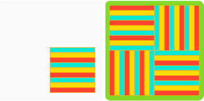

## Développer et tester : Motif

Il est maintenant temps de créer ton motif complet !

L'abstraction est la résolution de problèmes en réduisant les détails inutiles. 

--- task ---

Regarde ce gâteau malaisien en couches (kek lapis Sarawak). Comment le motif change-t-il pour former le motif général ?

Regarde ce papier peint art déco. Comment le motif change-t-il pour former le motif général ?

Pense au modèle que tu crées. Comment ton motif change-t-il pour créer le motif général. Utilise ces questions pour t'aider à faire abstraction :
- Est-ce que tout ou partie du motif tourne ?
- Dans quel sens tourne-t-il ? Et de combien ?
- Le motif comporte-t-il des couches qui se chevauchent ?
- Combien de fois le motif se répète-t-il ?
- Comment la répétition est-elle organisée (c'est-à-dire combien de lignes/colonnes) ?
- Les couleurs changent-elles ?
- Y a-t-il des détails qui ne sont pas inclus dans le motif (c'est-à-dire le glaçage du gâteau malaisien) ?

--- /task ---

--- task ---

Maintenant que tu en sais plus sur la façon dont le motif se transforme en motif complet, tu peux le programmer en utilisant tes réponses aux questions ci-dessus.

**Astuce :** n'oublie pas que tu peux « voir à l'intérieur » n'importe lequel des exemples de l'introduction et « copier » « coller » le code dans ton projet. Les développeurs professionnels le font tout le temps !

Tu as acquis des compétences vraiment utiles. Voici un rappel pour t'aider à réaliser ton motif répété :

[[[processing-matrix]]]

[[[processing-translation]]]

[[[processing-rotation]]]

[[[python-operators]]]

[[[generic-python-for-loop-repeat]]]

--- collapse ---

---
title: Positions aléatoires
---

Tu peux ajouter `from random import randint` en haut de **main.py**, cela te permet d'utiliser la fonction `randint` pour générer des nombres aléatoires.

Pour utiliser la fonction `randint`, tu dois l'appeler dans ton code.

Une façon d'utiliser l'aléatoire est de déplacer ton motif à une position aléatoire à chaque fois qu'il est dessiné :

--- code ---
---
language: python filename: main.py - draw()

---

    push_matrix() #Commencer la transformation 
    translate(randint(0, 400), randint(0, 400)) 
    dessin_motif() 
    pop_matrix() #Réinitialiser la transformation

--- /code ---

Tu peux également utiliser l'aléatoire pour modifier les couleurs de ton motif au fur et à mesure qu'il est redessiné.

--- code ---
---
language: python filename: main.py - draw()

---

    BLEU = color(randint(0, 50), randint(0, 100), randint(150, 255))

--- /code ---

--- /collapse ---

--- collapse ---

---
title: Modification de la taille de ton motif
---

Si tu utilises un motif que tu as déjà dessiné, il se peut qu'il ne soit pas de la bonne taille.

Tu peux utiliser `scale()` avant d'appeler la fonction qui dessine ton motif pour changer sa taille. L'utilisation d'une entrée supérieure à "1" agrandira le motif, l'utilisation d'une entrée inférieure à "1" le rendra plus petit.

--- code ---
---
language: python filename: main.py - draw()

---

    scale(0.5) #Moitié de la taille

--- /code ---

--- /collapse ---

--- /task ---

Tu peux maintenant animer ton motif pour montrer comment tu l'as créé. Souvent, les motifs ont une signification culturelle puissante dans la manière dont ils sont fabriqués ou dans le processus.

--- task ---

[[[processing-matrix]]]

[[[processing-translation]]]

[[[processing-rotation]]]

[[[generic-python-for-loop-repeat]]]

--- /task ---

--- task ---

**Test :** Montre ton projet à quelqu'un d'autre pour avoir son avis. Tu souhaites apporter des modifications à ton motif ?

--- /task ---

--- task ---

**Débogage :** Il est possible que tu trouves des bogues dans ton projet que tu dois corriger. Voici quelques bogues assez courants.

--- collapse ---

---
title: Mon motif ne semble pas tourner
---

Assure-toi d'utiliser la fonction `radian()` pour convertir les degrés en radians.

--- /collapse ---

--- collapse ---
---
title: La rotation semble étrange
---

As-tu vérifié que tu utilises `translate()` depuis et vers les bonnes coordonnées ?

As-tu plus d'une chose en rotation? Tu devras peut-être utiliser `push_matrix()` et `pop_matrix()` pour que l'écran tourne à différents points à la fois.

--- /collapse ---

--- collapse ---
---
title: Mon motif ne s'anime pas
---

Vérifie que tu as utilisé `frame_count()` correctement dans une boucle.

--- /collapse ---

--- collapse ---
---
title: Mon motif ne ressemble pas à ce que je veux qu'il soit
---

Passe en revue les sections ci-dessus sur `rotate()` et `translate()`. Expérimente jusqu'à ce que tu aies ce que tu veux, et rappelle-toi que les erreurs sont puissantes !

--- /collapse ---

--- collapse ---
---
title: J'obtiens une erreur
---

Vérifie la syntaxe de ton code. Te manque-t-il des parenthèses `(` ou `)` ou un deux-points `:` après avoir défini une fonction ? Est-ce que quelque chose est mal orthographié ? Ton code est-il correctement indenté ?

--- /collapse ---

--- collapse ---
---
title: L'animation est trop rapide/trop lente
---

Modifie le `frame_rate()` au début de ton programme pour l'obtenir à la vitesse que tu souhaites.

--- /collapse ---

Tu pourrais trouver un bogue qui n'est pas répertorié ici. Peux-tu trouver comment le réparer ?

Nous aimons avoir des nouvelles de tes bogues et de la façon dont tu les as corrigés. Utilise le bouton de commentaires au bas de cette page si tu as trouvé un bogue différent dans ton projet.

--- /task ---

--- save ---
