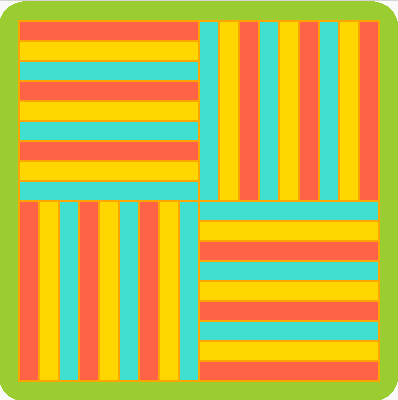
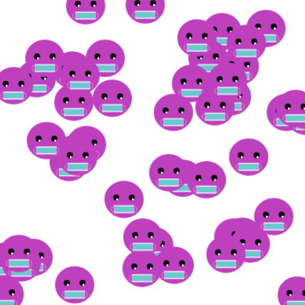

## Cosa creerai

Crea un'opera d'arte stimolante che può essere espansa impiegando la ripetizione di un modello.

Il tuo motivo meraviglioso dovrà soddisfare i **requisiti del progetto**.

I requisiti del progetto descrivono cosa deve restituire un progetto. È un po' come ricevere una missione da portare a termine.

Cosa farai:
+ Disegna e posiziona forme geometriche per creare un modello di base (o "motivo")
+ Usa cicli `for` per `spostare` il motivo e riempire lo schermo
+ Utilizza `frame_rate` e `frame_count` per animare la creazione del motivo

I modelli geometrici sono ovunque intorno a noi, nei tessuti, in natura, nell'arte, nelle tradizioni e nel design. Il punto di partenza di un modello è chiamato motivo, che è l'elemento che può essere ripetuto e disposto diversamente per creare diverse geometrie.

--- no-print ---

### Esegui ▶️

--- task ---

  

Fai clic sul pulsante **Run (esegui)** qui sotto per vedere questo esempio e pensa al motivo ripetuto. Come descriveresti ciò che accade nell'animazione?
**Torta a strati Sarawak**:
<iframe src="https://editor.raspberrypi.org/it-IT/embed/viewer/repeated-patterns-example" width="600" height="600" frameborder="0" marginwidth="0" marginheight="0" allowfullscreen>
</iframe>

Puoi trovare il progetto Torta a strati Sarawak [qui](https://editor.raspberrypi.org/it-IT/projects/repeated-patterns-example){:target="_blank"}
--- /task ---

### SPECIFICHE DI PROGETTO: Crea un **motivo meraviglioso**

 

Il tuo motivo magnifico dovrebbe:
+ Disegnare e posizionare forme geometriche per creare il modulo base
+ Utilizzare i cicli per ripetere il modulo e riempire lo schermo
+ Animare il modo in cui viene creato l'intero motivo geometrico

Il tuo motivo magnifico potrebbe:
+ Utilizzare colori forti o predominanti
+ Trarre ispirazione dalla tua cultura o dalla cultura popolare
+ Richiedere input dell'utente per ridimensionare il motivo
+ Aggiungere testo ed emoji per fornire informazioni circa la tua opera
+ Traslare il modulo per creare variazioni

### Lasciati ispirare 💭

--- task ---

Esegui questi progetti di esempio per trovare idee per il tuo motivo.

Come sono stati realizzati i motivi base usando cerchi, ellissi, quadrati, rettangoli e triangoli?:

**Spirali**:
<iframe src="https://editor.raspberrypi.org/it-IT/embed/viewer/spirals-pattern-example" width="600" height="700" frameborder="0" marginwidth="0" marginheight="0" allowfullscreen>
</iframe>
Puoi trovare il progetto Spirali [qui](https://editor.raspberrypi.org/it-IT/projects/spirals-pattern-example){:target="_blank"}

**Facce casuali**:
<iframe src="https://editor.raspberrypi.org/it-IT/embed/viewer/random-faces-example" width="600" height="700" frameborder="0" marginwidth="0" marginheight="0" allowfullscreen>
</iframe>
Puoi trovare il progetto Facce casuali [qui](https://editor.raspberrypi.org/it-IT/projects/random-faces-example){:target="_blank"}

<zero>Sfondo Art-deco</strong>:
<iframe src="https://editor.raspberrypi.org/it-IT/embed/viewer/art-deco-example" width="600" height="700" frameborder="0" marginwidth="0" marginheight="0" allowfullscreen>
</iframe>
Puoi trovare il progetto Art Déco [qui](https://editor.raspberrypi.org/it-IT/projects/art-deco-example){:target="_blank"}

**Tessitura Yakan**:
<iframe src="https://editor.raspberrypi.org/it-IT/embed/viewer/yakan-weaving-example" width="600" height="700" frameborder="0" marginwidth="0" marginheight="0" allowfullscreen>
</iframe>
Puoi trovare il progetto del tessuto Yakan [qui](https://editor.raspberrypi.org/it-IT/projects/yakan-weaving-example){:target="_blank"}

--- /task ---

--- /no-print ---

--- print-only ---

Guarda questi esempi e pensa al modulo ripetuto. Come sono stati realizzati i moduli usando cerchi, ellissi, quadrati, rettangoli e triangoli?

Puoi trovare il progetto Torta a strati Sarawak qui https://editor.raspberrypi.org/it-IT/projects/repeated-patterns-example

Puoi trovare il progetto Spirali qui https://editor.raspberrypi.org/it-IT/projects/spirals-pattern-example

Puoi trovare il progetto Facce casuali qui https://editor.raspberrypi.org/it-IT/projects/random-faces-example

Puoi trovare il progetto Art Déco qui https://editor.raspberrypi.org/it-IT/projects/art-deco-example

Puoi trovare il progetto del tessuto Yakan qui https://editor.raspberrypi.org/it-IT/projects/yakan-weaving-example

--- /print-only ---

