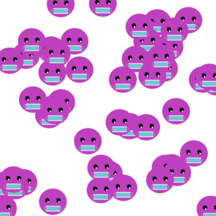

## You will make

このプロジェクトでは、繰り返し模様を使ったインスピレーションあふれるアートを作り出します。

魅力的な模様を**プロジェクト概要**に合わせて作成してください。

**プロジェクト概要** は、プロジェクトで実行しなければならないことを説明したものです。 達成すべきミッションのようなものです。

あなたは次のことを行います。
+ ベースパターン(もしくはモチーフ) を作成するために幾何学模様を描いて配置します。
+ `for`ループを使って、画面いっぱいに模様を`配置`してみましょう。
+ `frame_rate`と`frame_count`を使って、繰り返し模様をアニメーション化してみましょう。

わたしたちの周りには、洋服や、自然、アート、伝統工芸品、デザインなど、いろいろなところに繰り返し模様があります。 繰り返し模様の基本は、モチーフです。モチーフが基本のパーツとなり、繰り返したりアレンジされたりすることで、より複雑な繰り返し模様が作成されます。

--- no-print ---

--- task ---

### Play ▶️

この例を実行して、繰り返されるモチーフについて考えてみてください。 このアニメーションで、どんなことがおこっていると思いますか？

**ラピス・サラワクケーキ**: [中を見る](https://trinket.io/python/81be7eb895){:target="_blank"}

  <iframe src="https://trinket.io/embed/python/81be7eb895?outputOnly=true&start=result" width="600" height="500" frameborder="0" marginwidth="0" marginheight="0" allowfullscreen>
  </iframe>

--- /task ---

###プロジェクトの概要：**迫力のある模様**を作成する

 

迫力のある模様は次のようにする必要があります：
+ 幾何学模様を組み合わせてベースパターンを描きます
+ ループを使って模様を繰り返して画面全体に表示します
+ 繰り返し模様が作られるようにアニメーション化します

迫力のある模様は次のようにすることもできます：
+ 鮮やかで特徴的な色を使用する
+ 伝統的なものやポップカルチャーからインスピレーションを得る
+ ユーザが模様のサイズを変更できるようにする
+ テキストや絵文字を追加してあなたのアートについての詳細を表示する
+ 模様を変化させていろいろなバリエーションを作る

### Get ideas 💭

--- task ---

これらのサンプルプロジェクトを実行して、いい模様のアイデアをもらいましょう。

これらのモチーフは、どのような形から作られていますか？円、だ円、正方形、長方形、それとも三角形ですか？

**スパイラル**: [中を見る](https://trinket.io/python/a682f7a884){:target="_blank"}

  <iframe src="https://trinket.io/embed/python/a682f7a884?outputOnly=true&start=result" width="600" height="500" frameborder="0" marginwidth="0" marginheight="0" allowfullscreen>
  </iframe>

**ランダムフェイス**:[中を見る](https://trinket.io/python/c45185fd44){:target="_blank"}

  <iframe src="https://trinket.io/embed/python/c45185fd44?outputOnly=true&start=result" width="600" height="500" frameborder="0" marginwidth="0" marginheight="0" allowfullscreen>
  </iframe>

**アール・デコ風壁紙**: [中を見る](https://trinket.io/python/300e1cd325){:target="_blank"}

  <iframe src="https://trinket.io/embed/python/300e1cd325?outputOnly=true&start=result" width="600" height="500" frameborder="0" marginwidth="0" marginheight="0" allowfullscreen>
  </iframe>

**ヤカン柄**: [中を見る](https://trinket.io/python/20646dd7f4){:target="_blank"}

  <iframe src="https://trinket.io/embed/python/20646dd7f4?outputOnly=true&start=result" width="600" height="500" frameborder="0" marginwidth="0" marginheight="0" allowfullscreen>
  </iframe>

--- /task ---

--- /no-print ---

--- print-only ---

この例を実行して、繰り返されるモチーフについて考えてみてください。 これらのモチーフは、どのような形から作られていますか？円、だ円、正方形、長方形、それとも三角形ですか？

 ラピス・サラワクケーキプロジェクトには、こちらからアクセスできます。https://trinket.io/python/81be7eb895  スパイラルプロジェクトには、こちらからアクセスできます。https://trinket.io/python/a682f7a884  ランダムフェイスプロジェクトには、こちらからアクセスできます。 https://trinket.io/python/c45185fd44  アール・デコプロジェクトには、こちらからアクセスできます。https://trinket.io/python/300e1cd325  ヤカン柄プロジェクトには、こちらからアクセスできます。https://trinket.io/python/20646dd7f4

--- /print-only ---

