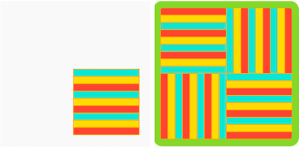

## テスト: 繰り返し模様

繰り返し模様の完成版を作りましょう。

抽象化 は、重要度の低い細かい部分を切り放すことで問題を解決する方法です。 

--- task ---

このマレーシアのレイヤーケーキ(サラワクレイヤーケーキ) を見てください。 モチーフはどのように変化して全体のパターンを作りますか？

このアールデコ調の壁紙を見てください。 モチーフがどのように変化して全体のパターンを作っていますか？

あなたが作っているパターンについて考えてみてください。 モチーフがどのように変化して全体のパターンを作りますか？ 次の質問を使用して、抽象化に役立ててください。
- モチーフの全体または一部が回転しますか？
- それはどの方向に回転しますか？ どのくらい回転しますか？
- パターンに重なるレイヤーはありますか？
- モチーフは何回繰り返されますか？
- 繰り返しはどのように行われますか(例：行/列の数)？
- 色は変わりますか？
- モチーフに含まれていないもの(例：マレーシアのレイヤーケーキの場合のアイシング)はありますか？

--- /task ---

--- task ---

モチーフがどのように変化して全体を作っていくかがわかったので、上記の質問への回答を使ってモチーフをプログラムできます。

**ヒント:** どの例も「中を見る」ことができ、コードを「コピー」して自分のプロジェクトに「貼り付ける」ことができます。 プロの開発者はいつもこのようなことを行っています！

あなたは本当に役立つスキルをいくつか身につけました。 モチーフを作成するのに役立つリマインダーは次のとおりです。

[[[processing-matrix]]]

[[[processing-translation]]]

[[[processing-rotation]]]

[[[python-operators]]]

[[[generic-python-for-loop-repeat]]]

--- collapse ---

---
title: ランダムな位置
---

`from random import randint` を **main.py**の先頭に入れることで、 乱数を生成する`randint` 関数を使えるようになります。

`randint` 関数を使うためには、コードの中で呼び出す必要があります。

乱数は、モチーフを描画するたびにランダムな位置にモチーフを移動するような場合に使います。

--- code ---
---
language: python filename: main.py - draw()

---

push_matrix() #Start transformation translate(randint(0, 400), randint(0, 400)) draw_motif() pop_matrix() #Reset transformation

--- /code ---

色を変えてモチーフを再描画する場合にも使うことができます。

--- code ---
---
language: python filename: main.py - draw()

---

BLUE = color(randint(0, 50), randint(0, 100), randint(150, 255))

--- /code ---

--- /collapse ---

--- collapse ---

---
title: モチーフのサイズを変化させる
---

すでに描いたモチーフを使用すると、サイズが合わない場合があります。

モチーフを描く関数を呼び出す前に`scale()` を使うことで、サイズを変更することができます。 「1」より大きい数字を入力するとモチーフが大きくなり、「1」より小さい数字を入力するとモチーフが小さくなります。

--- code ---
---
language: python filename: main.py - draw()

---

scale(0.5) #Half size

--- /code ---

--- /collapse ---

--- /task ---

ここまでで、パターンをアニメーション化して作成したものを見せることができます。 時に、パターンを作成する方法やプロセスが文化的に重要な意味を持つことがあります。

--- task ---

[[[processing-matrix]]]

[[[processing-translation]]]

[[[processing-rotation]]]

[[[generic-python-for-loop-repeat]]]

--- /task ---

--- task ---

**テスト：** プロジェクトを他の人に見せて、フィードバックをもらいます。 パターンを変更しますか?

--- /task ---

--- task ---

**デバッグ：** プロジェクトに修正が必要なバグが見つかる場合があります。 一般的なバグは次のとおりです。

--- collapse ---

---
title: モチーフが回転しない
---

度（degree）をラジアン（radian）に変換するのに、`radian()` 関数を使用していることを確認してください。

--- /collapse ---

--- collapse ---
---
title: 回転がおかしい
---

`translate()` を使用するとき、正しい座標点を指定しているか確認しましたか？

回転しているものが複数ありますか？ 同時に異なる場所で回転させるためには、`push_matrix()` と `pop_matrix()` を使用する必要があります。

--- /collapse ---

--- collapse ---
---
title: パターンのアニメーション化ができない
---

ループ内で `frame_count()` が正しく使用されているか確認してください。

--- /collapse ---

--- collapse ---
---
title: パターンが思い通りにできない
---

`rotate()` と `translate()`について、これまでのセクションを確認してください。 思い通りになるまで試行してください。間違いから学ぶことができます。

--- /collapse ---

--- collapse ---
---
title: エラーが発生します。
---

コードの構文を確認してください。 関数の定義のあと、括弧 `(` や `)`、コロン `:` を忘れていませんか？ スペルが間違っていませんか？ コードを正しくインデントしていますか？

--- /collapse ---

--- collapse ---
---
title: アニメーションが速すぎる/遅すぎる
---

プログラムの最初で`frame_rate()` を変更することで、速さを調整できます。

--- /collapse ---

ここに記載されていないバグが見つかるかもしれません。 あなたはそれを修正する方法を見つけることができますか？

私たちは、あなたのバグと、それらをどのように修正したかについて聞くのが大好きです。 プロジェクトで別のバグを見つけた場合、このページの一番下にあるフィードバックを送信 ボタンを使ってお知らせください。

--- /task ---

--- save ---
