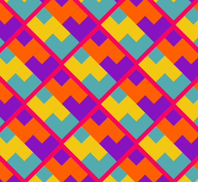

## Zrobisz to

Stwórz inspirującą sztukę, która może być skalowana za pomocą powtarzających się wzorów.

Twój potężny wzorzec będzie musiał spełnić brief projektu ** **.

Brief projektu   opisuje, co musi zrobić projekt. To trochę tak, jakby otrzymać misję do wykonania.

Co zrobisz:
+ Narysuj i umieść kształty geometryczne, aby utworzyć wzór bazowy (lub 'motif')
+ Użyj ` ` loops to ` translate ` the description, aby wypełnić ekran
+ Użyj ` frame_` i ` frame_`, aby animować tworzenie szyku

Wzory są wokół nas, w tekstyliach, przyrodzie, sztuce, tradycjach, i projektowanie. Punkt początkowy wzoru nazywa się  a , który jest elementem, który można powtarzać i układać w celu stworzenia wielu różnych wzorów.

--- no-print ---

### Graj ▶️

--- task ---

  

Kliknij przycisk **Run** poniżej, aby zobaczyć ten przykład i pomyśleć o powtarzającym się motywie. Jak opisałbyś to, co dzieje się w animacji?
**Kek lapis Sarawak**:
<iframe src="https://editor.raspberrypi.org/en/embed/viewer/repeated-patterns-example" width="600" height="600" frameborder="0" marginwidth="0" marginheight="0" allowfullscreen>
</iframe>

Możesz znaleźć projekt Kek lapis Sarawak {:target="_blank"}
--- /task ---

### OPIS PROJEKTU: Stwórz **potężny wzór**

Twój potężny wzór powinien:
+ Rysuj i pozycjonuj kształty geometryczne, aby utworzyć wzór bazowy
+ Użyj pętli, aby powtórzyć wzór, aby wypełnić ekran
+ Animuj sposób tworzenia wzoru

Twój potężny wzór może:
+ Użyj pogrubionych lub znaczących kolorów
+ czerp inspirację z kultury lub kultury popularnej
+ Uzyskaj dane użytkownika, aby zmienić rozmiar wzoru
+ Dodaj tekst i emoji, aby wydrukować szczegóły o swojej sztuce
+ Przetłumacz wzór, aby tworzyć odmiany

### Masz pomysły?

--- task ---

Uruchom te przykładowe projekty, aby uzyskać pomysły na swój wzór.

Jak powstały motywy z okręgów, elips, kwadratów, prostokątów i trójkątów?:

</strong> **:
<iframe src="https://editor.raspberrypi.org/en/embed/viewer/spirals-pattern-example" width="600" height="700" frameborder="0" marginwidth="0" marginheight="0" allowfullscreen>
</iframe> Możesz znaleźć projekt spirali {:target="_blank"}

** Losowe **:
<iframe src="https://editor.raspberrypi.org/en/embed/viewer/random-faces-example" width="600" height="700" frameborder="0" marginwidth="0" marginheight="0" allowfullscreen>
</iframe> Możesz znaleźć projekt losowe twarze {:target="_blank"}

** Deco tapeta **:
<iframe src="https://editor.raspberrypi.org/en/embed/viewer/art-deco-example" width="600" height="700" frameborder="0" marginwidth="0" marginheight="0" allowfullscreen>
</iframe> Możesz znaleźć projekt art deco {:target="_blank"}

** Yakan **:
<iframe src="https://editor.raspberrypi.org/en/embed/viewer/yakan-weaving-example" width="600" height="700" frameborder="0" marginwidth="0" marginheight="0" allowfullscreen>
</iframe> Możesz znaleźć projekt tkacki {:target="_blank"}

--- /task ---

--- /no-print ---

--- print-only ---

Spójrz na te przykłady i pomyśl o powtarzającym się motywie. Jak powstają wzory z okręgów, elips, kwadratów, prostokątów i trójkątów?

 Możesz znaleźć projekt Kek lapis Sarawak tutaj https://editor.raspberrypi.org/en/projects/repeated-patterns-example  Możesz znaleźć projekt Spirals tutaj https://editor.raspberrypi.org/en/projects/spirals-pattern-example  Możesz znaleźć projekt losowe twarze tutaj https://editor.raspberrypi.org/en/projects/random-faces-example  Projekt art deco możesz znaleźć tutaj https://editor.raspberrypi.org/en/projects/art-deco-example  Projekt tkania Yakan znajdziesz tutaj https://editor.raspberrypi.org/en/projects/yakan-weaving-example

--- /print-only ---

