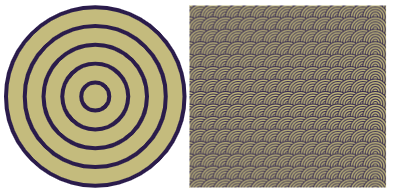

## Buduj i testuj: Motyw

Teraz nadszedł czas, aby twój motyw, pierwszy element twojego wzoru.

{:width="300px"}

Proces tworzenia twojego motywu jest taki sam, jak często robią to informatycy, gdy tworzą program lub rozwiązanie problemu. Proces ten nazywa się ** ** i użyjesz dekompozycji do stworzenia swojego motywu.

  rozbija coś na mniejsze i łatwiejsze do zrozumienia części. Oznacza to, że możesz budować szyk po jednej części na raz, dopóki nie zostanie ukończony.

Spójrz na wzór, który chcesz odtworzyć. Jak podzielić go na jeden element (motyw), który się powtarza?

W tym przykładzie wzór tapety w stylu art deco został rozłożony na podstawową kolekcję kształtów (nałożonych pięć okręgów), dzięki czemu motyw:

**Wskazówka:** Pamiętaj, aby testować swój projekt za każdym razem, gdy coś dodasz. Znacznie łatwiej jest znaleźć i naprawić błędy zanim wprowadzisz więcej zmian.

--- task ---

Zbudowałeś kilka naprawdę użytecznych umiejętności. Oto przypomnienie, które pomoże Ci stworzyć motyw:

### Kształty

[[[processing-python-ellipse]]]

[[[processing-python-rect]]]

[[[processing-python-triangle]]]

### Kolory i efekty

[[[generic-theory-simple-colours]]]

[[[processing-opacity]]]

[[[processing-stroke]]]

[[[processing-tint]]]

### Pozycjonowanie i przekształcanie

[[[processing-matrix]]]

[[[processing-translation]]]

[[[processing-rotation]]]

[[[python-operators]]]

[[[generic-python-for-loop-repeat]]]

--- /task ---

--- task ---

** Test:** Pokaż komuś inny swój projekt i uzyskaj ich opinię. Czy chcesz wprowadzić jakieś zmiany w swoim motywie?

--- /task ---

--- task ---

**Debugowanie:** Być może znajdziesz błędy w swoim projekcie, które musisz naprawić. Oto kilka typowych błędów.

--- collapse ---
---
Title: Kształty nie są wyrównane tak, jak się spodziewałem
---

Jeśli chcesz, aby kształty były wyrównane, przyjrzyj się bliżej swoim punktom współrzędnych. Eksperymentuj z liczbami, aż będziesz mieć pożądany układ.

--- /collapse ---

--- collapse ---

---
Title: Nie widzę niektórych kształtów w moim motywie
---

Kolejność rysowania rzeczy jest bardzo ważna.

Grafika komputerowa składa się z warstw. W Twoim motywie każdy kształt jest warstwą. Obiekty na wyższych warstwach znajdują się przed obiektami na niższych warstwach. Wyobraź sobie wycinanie wszystkich kształtów z papieru. W zależności od tego, jak układasz i nakładasz ten papier, końcowy wynik może wyglądać bardzo inaczej.

--- /collapse ---

--- collapse ---

---
Title: Moje kółka/kwadraty nie są równe
---

Trzecia i czwarta liczba w ` ` i ` ` to szerokość i wysokość. Jeśli uczynisz je takimi samymi, otrzymasz okrąg lub kwadrat.

--- /collapse ---

Możesz znaleźć robaka, którego tutaj nie ma. Czy możesz dowiedzieć się, jak to naprawić?

Uwielbiamy słuchać o błędach jakie znalazłeś i o tym, jak je naprawiłeś. Użyj przycisku opinii u dołu tej strony, jeśli znalazłeś innego robaka w swoim projekcie.

--- /task ---

--- save ---
