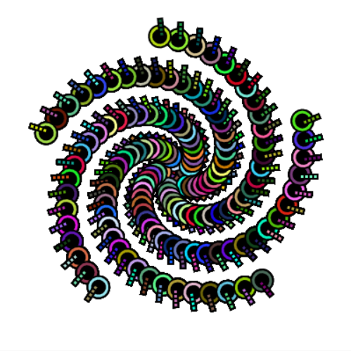

## O que você irá fazer

Crie uma inspiradora obra de arte, que pode ser desenhada com padrões escaláveis.

O seu super padrão deve atender aos critérios do **resumo do projeto**.

O resumo do projeto descreve o que um projeto deve fazer. É mais ou menos como receber uma missão para cumprir.

Você irá:
+ Desenhar e posicionar formas geométricas para criar um modelo como padrão (ou "motivo")
+ Use `for` laços para `traduzir` o modelo para preencher a tela
+ Use `taxa_de_quadros` e `contagem_de_quadros` para animar a criação do modelo padrão

Padrões estão em toda parte no mundo, na malha das roupas, na natureza, na arte, em tradições e design. O ponto de partida de um padrão é chamado de motivo, que é um elemento que pode ser repetido e organizado de forma a criar muitos padrões diferentes.

--- no-print ---

### Jogue ▶️

--- task ---

  

Clique no botão **Executar** abaixo para ver este exemplo e pense no motivo repetido. Como você descreveria o que está acontecendo na animação?
**Kek lapis Sarawak**:
<iframe src="https://editor.raspberrypi.org/en/embed/viewer/repeated-patterns-example" width="600" height="600" frameborder="0" marginwidth="0" marginheight="0" allowfullscreen>
</iframe>

Você pode encontrar o projeto Kek lapis Sarawak [aqui](https://editor.raspberrypi.org/en/projects/repeated-patterns-example){:target="_blank"}
--- /task ---

### RESUMO DO PROJETO: Crie um **super padrão**

Seu super padrão deve:
+ Desenhe e posicione formas geométricas para criar um modelo padrão
+ Use laos para repetir o padrão para preencher a tela
+ Anime como o padrão é criado
Seu super padrão pode:
+ Usar cores fortes ou significativas
+ Inspirar-se em sua cultura ou cultura popular
+ Obter entrada do usuário para redimensionar o padrão
+ Adicionar texto e emoji para imprimir detalhes sobre sua arte
+ Traduza o padrão para criar variações

### Obter ideias 💭

--- task ---

Execute estes projetos de exemplo para obter ideias para o seu padrão.

Como os motivos foram feitos de círculos, elipses, quadrados, retângulos e triângulos?:

**Espirais**:
<iframe src="https://editor.raspberrypi.org/en/embed/viewer/spirals-pattern-example" width="600" height="700" frameborder="0" marginwidth="0" marginheight="0" allowfullscreen>
</iframe> Você pode encontrar o projeto Espirais [aqui](https://editor.raspberrypi.org/en/projects/spirals-pattern-example){:target="_blank"}

**Faces aleatórias**:
<iframe src="https://editor.raspberrypi.org/en/embed/viewer/random-faces-example" width="600" height="700" frameborder="0" marginwidth="0" marginheight="0" allowfullscreen>
</iframe> Você pode encontrar o projeto Faces aleatórias [aqui](https://editor.raspberrypi.org/en/projects/random-faces-example){:target="_blank"}

**Papel de parede art déco**:
<iframe src="https://editor.raspberrypi.org/en/embed/viewer/art-deco-example" width="600" height="700" frameborder="0" marginwidth="0" marginheight="0" allowfullscreen>
</iframe> Você pode encontrar o projeto Papel de parede art déco [aqui](https://editor.raspberrypi.org/en/projects/art-deco-example){:target="_blank"}

**Yakan tecelagem**:
<iframe src="https://editor.raspberrypi.org/en/embed/viewer/yakan-weaving-example" width="600" height="700" frameborder="0" marginwidth="0" marginheight="0" allowfullscreen>
</iframe> Você pode encontrar o projeto Yakan tecelagem [aqui](https://editor.raspberrypi.org/en/projects/yakan-weaving-example){:target="_blank"}

--- /task ---

--- /no-print ---

--- print-only ---

Veja estes exemplos e pense no motivo repetido. Como os padrões foram feitos de círculos, elipses, quadrados, retângulos e triângulos?

 Você pode encontrar o projeto Kek lapis Sarawak aqui https://editor.raspberrypi.org/en/projects/repeated-patterns-example  Você pode encontrar o projeto Espirais aqui https://editor.raspberrypi.org/en/projects/spirals-pattern-example  Você pode encontrar as Faces aleatórias projeto aqui https://editor.raspberrypi.org/en/projects/random-faces-example  Você pode encontrar o projeto Art déco aqui https://editor.raspberrypi.org/en/projects/art-deco-example  Você pode encontrar o projeto de tecelagem Yakan aqui https://editor.raspberrypi.org/en/projects/yakan-weaving-example

--- /print-only ---

