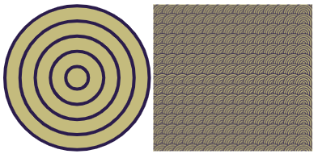

## Будуй та тестуй - Мотив

Настав час створити мотив - перший елемент твого візерунка.

{:width="300px"}

The process of making your motif is the same as what computer scientists often do when they create a program or solution to a problem. Цей процес має назву **декомпозиція**. Ти будеш використовувати декомпозицію для створення свого мотиву.

Декомпозиція - це розбиття чогось на невеликі частини, які легше зрозуміти. Це означає, що ти можеш створювати візерунок по одній частині, поки він не буде завершений.

Уяви або подивись на візерунок, який ти хочеш створити. Як можна розбити його на один єдиний елемент (мотив), який повторюється?

У цьому прикладі візерунок шпалер в стилі арт-деко розбитий на базову сукупність фігур (п'ять кіл, накладених один на одного), з яких складається мотив:

**Порада:** Не забувай тестувати свій проєкт кожного разу, коли щось додаєш. Набагато простіше знайти та виправити помилки до того, як внести нові зміни.

--- task ---

Ти здобув(-ла) дійсно дуже корисні навички. Ось нагадування, яке допоможе тобі створити свій мотив:

### Фігури та зображення

[[[processing-python-ellipse]]]

[[[processing-python-rect]]]

[[[processing-python-triangle]]]

### Кольори та ефекти

[[[generic-theory-simple-colours]]]

[[[processing-opacity]]]

[[[processing-stroke]]]

[[[processing-tint]]]

### Розташування та перетворення

[[[processing-matrix]]]

[[[processing-translation]]]

[[[processing-rotation]]]

[[[python-operators]]]

[[[generic-python-for-loop-repeat]]]

--- /task ---

--- task ---

**Тест:** Покажи комусь свій проєкт та отримай зворотний зв'язок. Ти хочеш внести якісь зміни у свій мотив?

--- /task ---

--- task ---

**Налагодження:** Можливо, у твоєму проєкті знайдуться помилки, які потрібно буде виправити. Ось деякі поширені помилки.

--- collapse ---
---
title: Фігури вирівняні не так, як я очікував(-ла)
---

Якщо ти хочеш, щоб фігури були вирівняні - придивись уважніше до своїх координатних точок. Експериментуй з цифрами, поки не отримаєш потрібний тобі варіант.

--- /collapse ---

--- collapse ---

---
title: Я не бачу деякі фігури на моєму мотиві
---

Порядок, в якому ти малюєш деталі, дуже важливий.

Комп'ютерна графіка побудована з багатьох шарів. У твоєму мотиві кожна фігура - це шар. Об'єкти на вищих шарах знаходяться перед об'єктами на нижчих шарах. Уяви, що ти вирізаєш всі фігури з паперу. Залежно від того, як ти будеш розташовувати та накладати цей папір, кінцевий результат може виглядати зовсім по-різному.

--- /collapse ---

--- collapse ---

---
title: Кола/квадрати не рівні
---

Третій та четвертий номери у `ellipse` та `rect` - це ширина та висота. Якщо зробити їх однаковими - вийде коло або квадрат.

--- /collapse ---

Ти можеш виявити помилку, яка не вказана тут. Можливо, ти зможеш придумати, як її виправити?

Нам подобається дізнаватись про твої помилки та про те, як їх вдалося виправити. Якщо ти знайшов(-ла) іншу помилку у своєму проєкті, скористайся формою зворотного зв'язку внизу цієї сторінки.

--- /task ---

--- save ---
