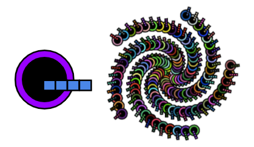

## Розширюй та тестуй - Візерунок

Настав час зібрати повноцінний візерунок!

Абстракція - це вирішення проблем шляхом зменшення непотрібних деталей. 

--- task ---

Подивись на цей Малайзійський листковий торт (kek lapis Sarawak). Як змінюється його мотив, щоб утворився загальний візерунок?

Подивись на ці шпалери в стилі арт-деко. Як змінюється його мотив, щоб утворився загальний візерунок?

Подумай про візерунок, який ти створюєш. Як змінюється твій мотив, щоб скласти загальний візерунок? Використовуй ці питання, які допоможуть тобі зробити висновки:
- Мотив обертається повністю або тільки його частина?
- В який бік він обертається? І на скільки?
- Чи має малюнок шари, які накладаються один на одного?
- Скільки разів повторюється мотив?
- Як відбувається повторення (тобто скільки рядків/стовпчиків)?
- Чи змінюються кольори?
- Чи є якісь інші деталі, які не входять до мотиву (наприклад, глазур у Малайзійському листковому торті)?

--- /task ---

--- task ---

Тепер, коли ти знаєш більше про перетворення мотиву в цілий візерунок - запрограмуй свій мотив, використовуючи свої відповіді на питання, наведені вище.

**Tip:** You can 'copy' and 'paste' code from any of the examples in the introduction into your project. Професійні девелопери роблять це постійно!

Ти здобув(-ла) дійсно дуже корисні навички. Ось нагадування, яке допоможе тобі створити повторення візерунка:

[[[processing-matrix]]]

[[[processing-translation]]]

[[[processing-rotation]]]

[[[python-operators]]]

[[[generic-python-for-loop-repeat]]]

--- collapse ---

---
title: Випадкові позиції
---

Ти можеш додати `from random import randint` у верхній частині **main.py** - це дозволить використовувати функцію `randint` для генерування випадкових чисел.

Для використання функції `randint` необхідно викликати її у своєму коді.

Один із способів використання рандому - це переміщення мотиву у випадкову позицію кожного разу, коли він малюється:

--- code ---
---
language: python filename: main.py - draw()

---

    push_matrix()  # Start transformation
    translate(randint(0, 400), randint(0, 400))
    draw_motif()
    pop_matrix()  # Reset transformation

--- /code ---

Ти також можеш використовувати випадковий порядок для зміни кольорів твого мотиву під час його малювання.

--- code ---
---
language: python filename: main.py - draw()

---

    BLUE = color(randint(0, 50), randint(0, 100), randint(150, 255))

--- /code ---

--- /collapse ---

--- collapse ---

---
filename: main.py - draw()
---

Якщо ти використовуєш вже намальований мотив, він може бути неправильного розміру.

Ти можеш використовувати `scale()` перед викликом функції, яка малює мотив, щоб змінити його розмір. Using an input bigger than '1' will make the motif bigger, using an input smaller than '1' will make it smaller.

--- code ---
---
language: python filename: main.py - draw()

---

    scale(0.5)  # Half size

--- /code ---

--- /collapse ---

--- /task ---

Тепер ти можеш додати до свого візерунка анімацію, щоб показати, як він був створений. Часто візерунки мають велике культурне значення в тому, яким чином вони зроблені, або в процесі їх виготовлення.

--- task ---

[[[processing-matrix]]]

[[[processing-translation]]]

[[[processing-rotation]]]

[[[generic-python-for-loop-repeat]]]

--- /task ---

--- task ---

**Тест:** Покажи комусь свій проєкт та отримай зворотний зв'язок. Ти хочеш внести якісь зміни до свого візерунка?

--- /task ---

--- task ---

**Налагодження:** Можливо, у твоєму проєкті знайдуться помилки, які потрібно буде виправити. Ось деякі поширені помилки.

--- collapse ---

---
filename: main.py - draw()
---

Переконайся, що ти використовуєш функцію `radian()` для перетворення градусів у радіани.

--- /collapse ---

--- collapse ---
---
title: Зміна розміру мотиву
---

Переконайся, що ти використовуєш функцію `radian()` для перетворення градусів у радіани.

У тебе обертається більше одного елемента? Тобі може знадобитися використати `push_matrix()` та `pop_matrix()`, щоб екран обертався одночасно в різних точках.

--- /collapse ---

--- collapse ---
---
filename: main.py - draw()
---

Перевір правильність використання `frame_count()` у циклі.

--- /collapse ---

--- collapse ---
---
title: Здається, мій мотив не обертається
---

Переглянь наведені вище пункти про `rotate()` та `translate()`. Експериментуй, поки не отримаєш бажаного результату, і пам'ятай, що помилки - це сила!

--- /collapse ---

--- collapse ---
---
title: Ротація виглядає дивно
---

Перевір синтаксис свого коду. Чи не пропущені якісь дужки `(` або `)`, або двокрапка `:` після визначення функції? Щось неправильно написано? Чи правильно розставлені у коді відступи?

--- /collapse ---

--- collapse ---
---
title: Мій візерунок не має анімації
---

Change the number after `frame_rate =` in the call to the `run()` function at the end of your program to get it to the speed you like.

--- /collapse ---

Ти можеш виявити помилку, яка не вказана тут. Можливо, ти зможеш придумати, як її виправити?

Нам подобається дізнаватись про твої помилки та про те, як їх вдалося виправити. Якщо ти знайшов(-ла) іншу помилку у своєму проєкті, скористайся формою зворотного зв'язку внизу цієї сторінки.

--- /task ---

--- save ---
